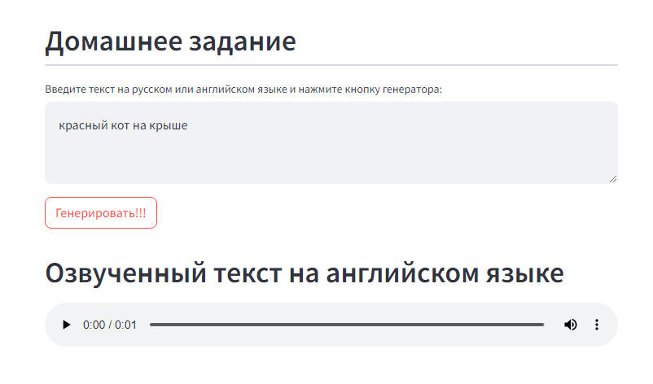
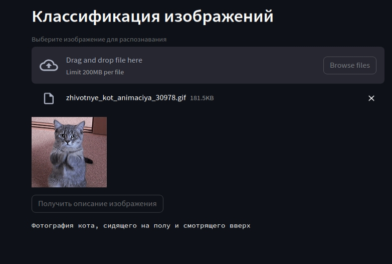

# Программная инженерия. Практическое задание №2

Приложение разработано с использованием фреймворка [Streamlit](https://streamlit.io/).
Состоит из двух страниц и Главной страницы:
1. Главная страница - содержит описание из README
2. Генератор аудио - позволяет сгенерировать аудио по введенному тексту на английском языке. Дополнительно осуществляет перевод с русского языка на английский (при вводе текста на русском языке). Используется 3 модели:
    - Определение языка текста
    - Перевод текста с языка Ru на En
    - Озвучивание текста на английском языке
3. Описание изображения - позволяет получить описание изображения на русском языке. Использует 1 модель:
    - Классификация и описание изображений

## Используемые модели
- Определение языка текста - [papluca/xlm-roberta-base-language-detection](https://huggingface.co/papluca/xlm-roberta-base-language-detection)
- Перевод текста с языка Ru на En - [Helsinki-NLP/opus-mt-ru-en](https://huggingface.co/Helsinki-NLP/opus-mt-ru-en)
- Озвучивание текста на английском языке - [microsoft/speecht5_tts](https://huggingface.co/microsoft/speecht5_tts)
- Классификация и описание изображений. Модель описания изображения [Salesforce/blip-image-captioning-large](https://huggingface.co/Salesforce/blip-image-captioning-large)

## Как запустить
Запуск осуществляется через модуль streamlit:
```
streamlit run <путь>\run.py
```

## Как использовать
После запуска приложение открывается на Главной странице. Выбор режима работы приложения доступен слева в меню

### Генератор аудио
Необходимо ввести текст в текстовое поле и нажать кнопку "Генерация". В результате появится аудио запись на английском языке с описанием введенного текста.



### Описание изображения
Необходимо выбрать изображение и нажать кнопку "Получить описание изображения". В результате появится текстовое описание изображения на русском языке.


